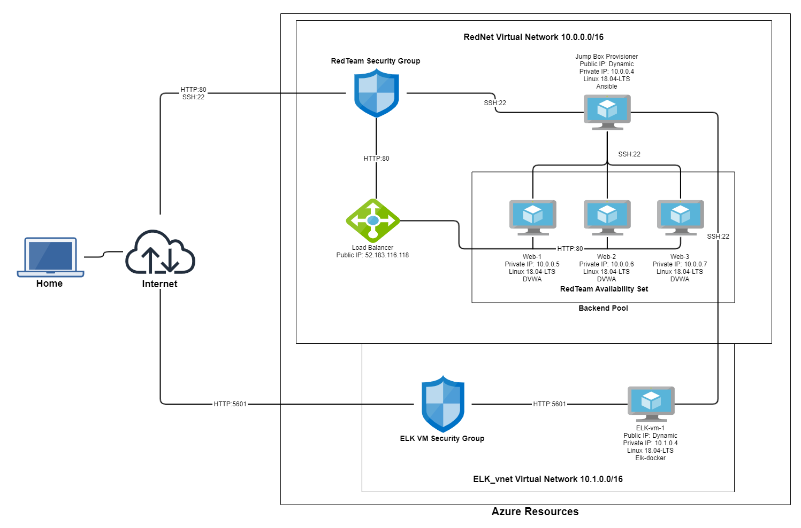
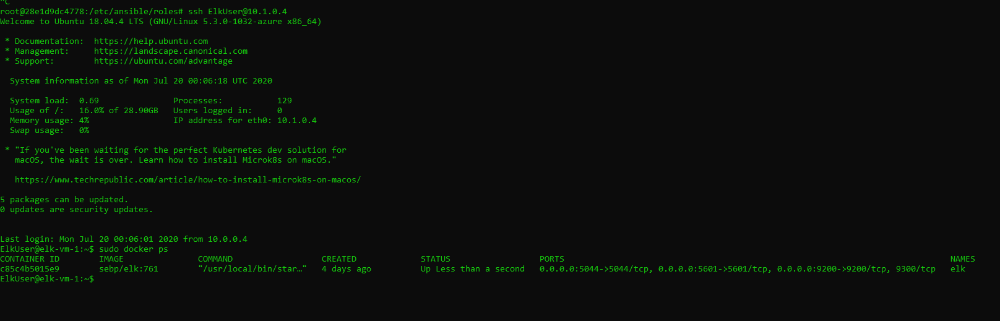

## Automated ELK Stack Deployment

The files in this repository were used to configure the network depicted below.

These files have been tested and used to generate a live ELK deployment on Azure. They can be used to either recreate the entire deployment pictured above. Alternatively, select portions of the beat-playbook.yml file may be used to install only certain pieces of it, such as Filebeat.

  - install-elk.yml
  - beat-playbook.yml
  - uninstall-beat-playbook.yml
  - pentest.yml

This document contains the following details:
- Description of the Topology
- Access Policies
- ELK Configuration
  - Beats in Use
  - Machines Being Monitored
- How to Use the Ansible Build

### Description of the Topology

The main purpose of this network is to expose a load-balanced and monitored instance of DVWA, the D*mn Vulnerable Web Application.

Load balancing ensures that the application will be highly resilient, in addition to restricting access to the network.
The jump box serves to reduce the number of entry points into the network.

Integrating an ELK server allows users to easily monitor the vulnerable VMs for changes to the file system and system metrics.
The beat-playbook file helps to install Filebeat and Metricbeat into the web machines for this purpose.

The configuration details of each machine may be found below.

| Name               | Function      | IP Address           | Operating System   |
|--------------------|---------------|----------------------|--------------------|
| JumpBoxProvisioner | Gateway       | 10.0.0.4             | Linux Ubuntu 18.04 |
| Web-1              | Web Server    | 10.0.0.5             | Linux Ubuntu 18.04 |
| Web-2              | Web Server    | 10.0.0.6             | Linux Ubuntu 18.04 |
| Web-3              | Web Server    | 10.0.0.7             | Linux Ubuntu 18.04 |
| RedTeamLB          | Load Balancer | 52.183.116.118       | N/A                |
| elk-vm-1           | ELK Server    | 10.1.0.4             | Linux Ubuntu 18.04 |

### Access Policies

The machines on the internal network are not exposed to the public Internet. 

Only the RedTeamLB (Load Balancer) machine can accept connections from the Internet. Access to this machine is only allowed from the following IP address:
72.219.125.158

Machines within the network can only be accessed by the Jump Box.
Only the Jump Box can ssh into the ELK server.

A summary of the access policies in place can be found in the table below.

| Name                | Publicly Accessible | Allowed IP Addresses |
|---------------------|---------------------|----------------------|
| JumpBoxProvisioner  | Yes                 | 72.219.125.158       |
| Web-1               | No                  | 10.0.0.4             |
| Web-2               | No                  | 10.0.0.4             |
| Web-3               | No                  | 10.0.0.4             |
| RedTeamLB           | Yes                 | 72.219.125.158       |
| elk-vm-1            | Yes                 | 72.219.125.158       |

### Elk Configuration

Ansible was used to automate configuration of the ELK machine. No configuration was performed manually, which is advantageous because it is easily reproducable, error prone,
and fast to perform.

The playbook implements the following tasks:
- download docker.io
- download python3-pip
- install the docker python package
- increase memory usage for the machine
- download and start the elk-docker container

The following screenshot displays the result of running `docker ps` after successfully configuring the ELK instance.

### Target Machines & Beats
This ELK server is configured to monitor the following machines:
- web-1
- web-2
- web-3

We have installed the following Beats on these machines:
- Filebeat
- Metricbeat

These Beats allow us to collect the following information from each machine:
- Filebeat allows us to view logs such as system.syslog (system logs)
- Metricbeat allows us to view metrics such as Docker metrics which describe Docker containers

### Using the Playbook
In order to use the playbook, you will need to have an Ansible control node already configured. Assuming you have such a control node provisioned: 

SSH into the control node and follow the steps below:
- Copy the install-elk.yml file to your /etc/ansible folder.
- Update the hosts file to include your elk machine's private IP address and create a new elk group for your elk machine
- Run the playbook, and navigate to http://yourelkpublicip:5601/app/kibana to check that the installation worked as expected.